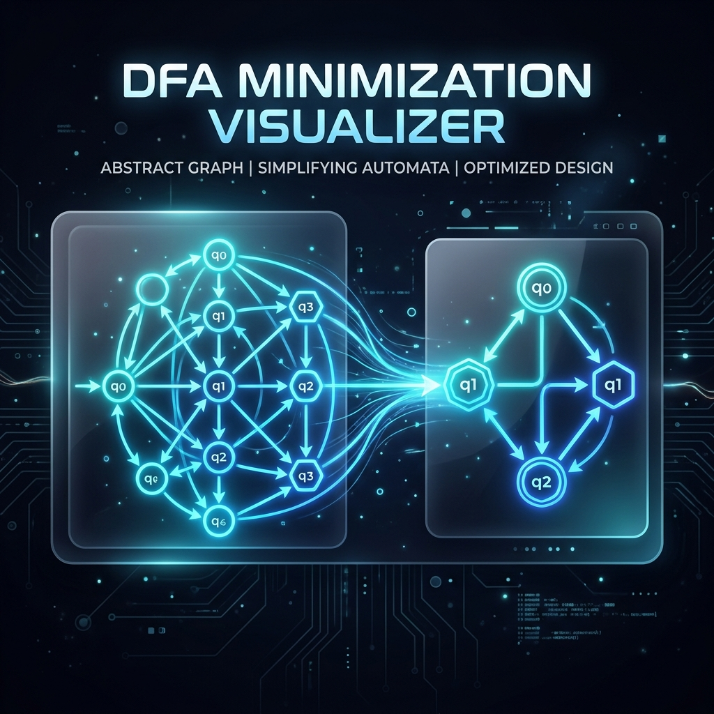
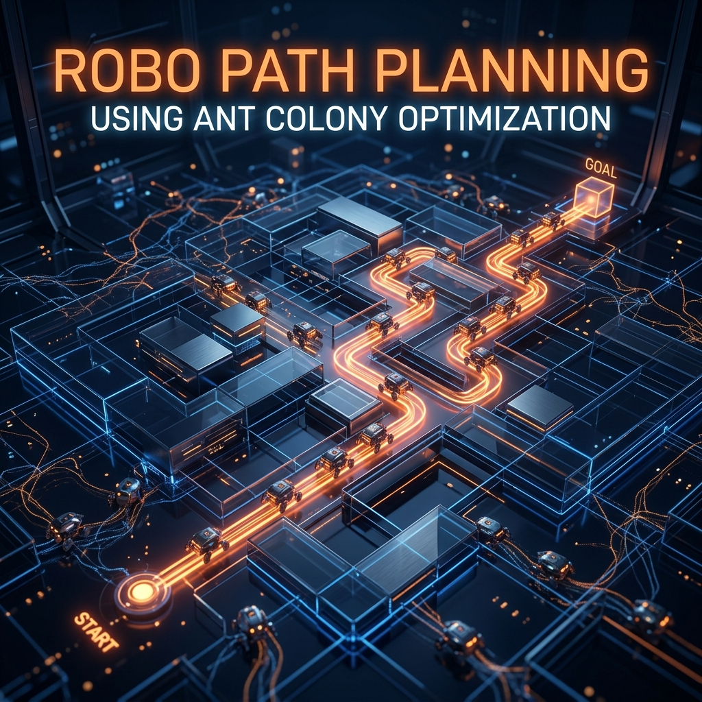

# 
✨ Welcome to my Profile! ✨

  

  

---

###  About Me
I'm a passionate developer focused on building high-performance, visually stunning, and intelligent software. I love exploring the intersection of algorithms and design.

- 🔭 I’m currently working on **DFA Minimization Visualizer**
- 🌱 I’m currently learning **Advanced Database Systems & AI Algorithms**
- 💬 Ask me about **DFA, ACO, or DBMS**
- 📫 How to reach me: [LinkedIn](https://www.linkedin.com/in/ishan-maurya/) (Update this with your real link!)

---

### 🚀 Featured Projects

<table border="0">
  <tr>
    <td width="50%">
      
      <h4><a href="https://github.com/ISHAN12369/dfa-minimization-visualizer">DFA Minimization Visualizer</a></h4>
      
A real-time, animated tool to visualize DFA minimization. Built with React and Cytoscape.js for smooth graph transitions.

      <code>React</code> <code>Vite</code> <code>Cytoscape.js</code> <code>Framer Motion</code>
    </td>
    <td width="50%">
      
      <h4><a href="https://github.com/ISHAN12369/robo_path_aco">Robo Path Planning (ACO)</a></h4>
      
Intelligent pathfinding using Ant Colony Optimization. Simulates swarm intelligence for robotic navigation.

      <code>C++</code> <code>SFML</code> <code>JavaScript</code> <code>ACO</code>
    </td>
  </tr>
  <tr>
    <td width="50%">
      
      <h4><a href="https://github.com/ISHAN12369/dbms-project">Hostel Management DBMS</a></h4>
      
A comprehensive hostel management system with robust database architecture and modern UI.

      <code>Express.js</code> <code>SQLite</code> <code>Node.js</code> <code>EJS</code>
    </td>
    <td>
      <!-- More space for future projects -->
    </td>
  </tr>
</table>

---

### 🛠️ Tech Stack & Skills

  

---

### 📊 GitHub Stats

  
  

  

---

  

  Made with ❤️ by ISHAN12369

